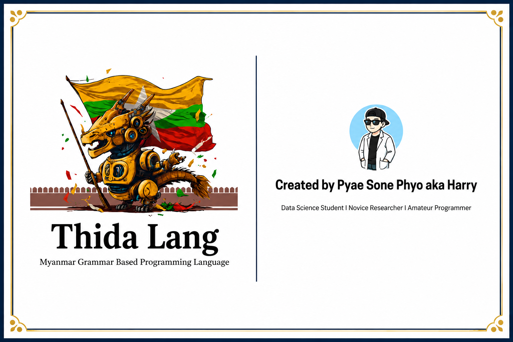

# Thida Lang 1.2 — Beta



**A Myanmar grammar-based programming language for data analysis.**

Thida Lang lets you write data analysis code using natural Myanmar sentence structure — every statement ends with a descriptive Burmese verb, making programs readable as plain Burmese text.

> **Documentation:** https://docs-thidalang.netlify.app/

---

## Overview

Thida Lang is the first approach to a programming language that applies Myanmar grammar-based syntax structure. There were some programming languages that used Myanmar script before, but most of them followed English grammar patterns, so they were not as natural to read as native Burmese.

The idea came from a simple question: what if a programming language could follow the Myanmar grammar structure (Subject–Object–Verb)? I wanted to test whether it could actually work.

Before starting this project, I watched some YouTube videos about creating a new programming language. To be honest, I was never very good at programming, and I am still not very good at it now. But I wanted to see if this idea could become reality.

---

## The Journey

I never expected Thida Lang to go viral or receive recognition from seniors and experts. When I first started the project, I thought it was just a small experiment. However, the journey from a research idea to a working product was much harder than I imagined. Part of that difficulty came from my limited technical skills and experience.

In 2025, I decided to stop working on the project. At that time, I was facing many challenges in my personal life. I also realized that I could not survive by working on this project alone, and there was no funding or grant available for me to continue. As a result, I put the project aside.

Everything changed in 2026 when one of my Vietnamese friends from university called me. He showed me that he could find my project and my name on Google. Seeing that surprised me and gave me a new spark of motivation. For the first time in a long while, I felt like I wanted to give the project another chance.

Looking back, I realized that in 2024 I often talked about ideas that were bigger than my actual ability to execute. I spent a lot of time imagining what I could build instead of building it. Because of that, I decided to take a different approach this time. I wanted to keep things simple, focus on what I could actually do, and spend more time making things work than talking about them.

This new attempt in 2026 is different from the previous ones. At university, most of my data science courses are taught using R programming. To be honest, I never enjoyed using R as much as Python. Still, studying R gave me a practical idea about what my programming language could become.

The original reason I started Thida Lang was simple. I wanted to create a programming language that follows Myanmar grammar instead of English grammar. Rather than trying to build a complete replacement for existing programming languages, I began thinking about practical and realistic ways to make the idea useful. That became the foundation of my new approach to Thida Lang in 2026.

I know there are many other projects that are more practical and many bigger problems that need to be solved. However, this project gives me a special feeling. It reminds me of the chorus of the song *Wavin' Flag* — the feeling that even if the journey is difficult, you still keep moving forward because you believe in something and you become stronger and free.

That is why I want to continue working on Thida Lang. Not in a fancy way, and not by making big promises. I want to build it slowly, step by step, learning along the way and turning ideas into something real. Whether it becomes successful or not, I want to keep trying and see how far this journey can go.

---

## Contributors

10 people contributed across 5 areas to bring Thida Lang 1.2 to life.

### Creator

**Pyae Sone Phyo (Harry)**  
Founded and built Thida Lang from the ground up. Designed the language grammar, implemented the lexer, parser, and interpreter, and built the web IDE. Data Science Student, Amateur Programmer, and Novice Researcher.

### Research Supervision

| Name | Role | Contribution |
|------|------|-------------|
| Dr. Myo Myint Oo | Research Supervisor | Provided academic supervision and guidance throughout the research and development process of Thida Lang. |

### Syntax Design

| Name | Role | Contribution |
|------|------|-------------|
| Saw Yan Naing | Syntax Design | Helped shape the Myanmar grammar-based syntax structure and verb patterns of the language. |
| May Mon Thant | Syntax Design | Contributed to the design of natural-language syntax rules and Myanmar sentence structure alignment. |
| Khine Su Myat Theim | Syntax Design | Assisted in refining the SOV grammar structure and ensuring natural readability of Thida Lang statements. |

### NLP Advice

| Name | Role | Contribution |
|------|------|-------------|
| Min Sithu | NLP Advice | Provided advice on natural language processing approaches for Myanmar script tokenization and parsing. |
| Min Htet Myat | NLP Advice | Assisted with NLP guidance on handling Myanmar Unicode and linguistic edge cases in the lexer. |

### User Acceptance Testing

| Name | Role | Contribution |
|------|------|-------------|
| Thi Han Htun (Louis) | UAT Testing | Tested the language and IDE from a user perspective, providing feedback on usability and bugs. |
| Phúc Trần | UAT Testing | Conducted user acceptance testing and helped validate the IDE experience from an international user's perspective. |
| Kaung Myat Tun | UAT Testing | Performed end-to-end testing of language features and reported issues to improve overall reliability. |

---

## Table of Contents

- [Overview](#overview)
- [The Journey](#the-journey)
- [Contributors](#contributors)
- [Quick Start](#quick-start)
- [Installation](#installation)
- [Web IDE](#web-ide)
- [Language Reference](#language-reference)
  - [Output](#output)
  - [Loading Data](#loading-data)
  - [Variables](#variables)
  - [Data Inspection](#data-inspection)
  - [Statistical Functions](#statistical-functions)
  - [Data Cleaning & Manipulation](#data-cleaning--manipulation)
  - [Modeling](#modeling)
  - [Visualization](#visualization)
  - [Reporting](#reporting)
  - [Comments](#comments)
- [Running Scripts](#running-scripts)
- [REPL](#repl)
- [Architecture](#architecture)
- [Examples](#examples)
- [Acknowledgements](#acknowledgements)
- [References](#references)
- [License](#license)

---

## Quick Start

```bash
# Clone / navigate to project
cd ThidaLang1.2

# Install dependencies
pip3 install -r requirements.txt

# Run a script
python3 thida_run.py examples/hello_world.thida

# Start the web IDE
python3 web/app.py
# → open http://localhost:5000
```

---

## Installation

**Requirements:** Python 3.9+

```bash
pip3 install pandas numpy openpyxl scikit-learn matplotlib reportlab flask
```

Or install everything at once:

```bash
pip3 install -r requirements.txt
```

---

## Web IDE

Thida Lang ships with a browser-based IDE inspired by RStudio, with four panels running side by side.

```bash
python3 web/app.py
```

Then open **http://localhost:5050** in your browser.

```
+---------------------+---------------------+
|  Code Editor        |  Data Viewer        |
|  (write & run)      |  (loaded tables)    |
+---------------------+---------------------+
|  Console            |  Plots              |
|  (output / errors)  |  (charts & graphs)  |
+---------------------+---------------------+
```

Features:
- Myanmar syntax highlighting in both dark and light themes
- Data Viewer panel — inspect loaded datasets as scrollable tables
- Plots panel — all 5 chart types rendered with statistical descriptions
- Docs panel — read lesson docs separately without touching your code
- Sidebar: file explorer, dataset manager with upload, quick snippets
- Error highlighting with line numbers
- Resizable panels (drag the dividers)
- Keyboard shortcuts: `Ctrl+Enter` run · `Ctrl+S` save · `Ctrl+B` sidebar

---

## Language Reference

### Design Philosophy

Every statement follows a **Verb-Object** pattern: the object (data, expression) comes first inside parentheses `( )`, and the verb (action) follows as a Myanmar suffix. This mirrors natural Burmese sentence structure.

```
(object) ကိုverb
```

---

### Output

Print any value to the console.

```thida
("မင်္ဂလာပါ၊ Thida မှ ကြိုဆိုပါသည်!") ကိုအဖြေထုတ်ပါ
(42) ကိုအဖြေထုတ်ပါ
(my_variable) ကိုအဖြေထုတ်ပါ
```

---

### Loading Data

**CSV:**
```thida
("data.csv" , file type = csv , safe copy = true) ကိုဖတ်ပါ
```

**Excel:**
```thida
("report.xlsx" , file type = excel , Sheet = "Sheet1" , safe copy = true) ကိုဖတ်ပါ
```

> The dataset is automatically stored under the filename stem (e.g. `"data.csv"` → variable `data`).
> `safe copy = true` prevents accidental mutation of the original data.

---

### Variables

**Assign a value:**
```thida
(42) ကို my_number ဟု သတ်မှတ်ပါ
("Thida") ကို lang_name ဟု သတ်မှတ်ပါ
```

**Save a dataset under a new name:**
```thida
(students) ကို backup အဖြစ် သိမ်းဆည်းပါ
```

**Display a variable:**
```thida
(my_number) ကို ဖော်ပြပါ
(students) ကို ဖော်ပြပါ
```

---

### Data Inspection

```thida
/* Show column names */
("students") ရဲ့ Header ဖော်ပြပါ

/* Full summary statistics */
("students") အကျဥ်းချုပ် ဖော်ပြပါ

/* First N rows */
("students") ရဲ့ အစပိုင်း "10" လိုင်းဖော်ပြပါ

/* Column data types */
("students") ရဲ့ အမျိုးအစားများ ဖော်ပြပါ
```

---

### Statistical Functions

| Operation | Syntax |
|-----------|--------|
| Mean      | `("dataset" > "column") mean ကိုဖော်ပြပါ` |
| Maximum   | `("dataset" > "column") max ကိုဖော်ပြပါ` |
| Minimum   | `("dataset" > "column") min ကိုဖော်ပြပါ` |
| Mode      | `("dataset" > "column") mode ကိုဖော်ပြပါ` |
| Frequency | `("dataset" ရဲ့ "column") frequency ကိုဖော်ပြပါ` |
| Group By  | `("dataset" > group by "col_a" , mean "col_b") ကို အုပ်စုလိုက်တွက်ချက်ပါ` |

**Example:**
```thida
("sales" > "Revenue") mean ကိုဖော်ပြပါ
("sales" > "Revenue") max ကိုဖော်ပြပါ
("sales" ရဲ့ "Region") frequency ကိုဖော်ပြပါ
("sales" > group by "Region" , mean "Revenue") ကို အုပ်စုလိုက်တွက်ချက်ပါ
```

---

### Data Cleaning & Manipulation

**Count missing values:**
```thida
("students" > "missing values") အရေအတွက်ကို ဖော်ပြပါ
```

**Fill missing values:**
```thida
/* Fill with mean, median, mode, or a specific value */
("students" > missing values = "mean") အဖြစ် ဖော်ပြပါ
("students" > missing values = "median") အဖြစ် ဖော်ပြပါ
("students" > missing values = 0) အဖြစ် ဖော်ပြပါ
```

**Drop rows with missing values:**
```thida
("students") ထဲက အချက်အလက်မပြည့်စုံတာတွေကို ဖယ်ရှားပါ
```

**Drop a column:**
```thida
("students" > "TempColumn") ဖျက်ပေးပါ
```

**Create a new derived column:**
```thida
("sales" > "Tax" , newcolumn = Revenue * 0.1) Column အသစ်လုပ်ပါ
```

**Filter rows:**
```thida
("students" > "Grade" == "A") ကိုခွဲထုတ်ပါ
("sales" > "Revenue" >= 5000) ကိုခွဲထုတ်ပါ
```

**Sort:**
```thida
/* Descending */
("students" > "Score") ကို တန်ဖိုးကြီးစဥ် စီပေးပါ

/* Ascending */
("students" > "Score") ကို တန်ဖိုးငယ်စဥ် စီပေးပါ
```

**Rename a column:**
```thida
("sales" > "Rev" to "Revenue_USD") နာမည်ပြောင်းပါ
```

---

### Modeling

Thida Lang supports linear regression out of the box.

**1. Define a model (R-style formula):**
```thida
("housing" > "price" ~ "size" + "bedrooms") ကို price_model linear_model အဖြစ်သတ်မှတ်ပါ
```

**2. Train:**
```thida
("price_model" , "housing") ကို train လုပ်ပါ
```
Output includes R², RMSE, and coefficients.

**3. Predict:**
```thida
("price_model" , "new_houses") ကို ခန့်မှန်းပါ
```
Predictions are saved to the `predictions` dataset.

---

### Visualization

**Scatter plot:**
```thida
("sales" > x = "Units" , y = "Revenue") ကို scatter_plot အဖြစ် ပုံဆွဲပေးပါ
```

**Histogram:**
```thida
("sales" > group by "Revenue" , plot = "histogram") ကို ပုံဆွဲပေးပါ
```

Plots are saved as PNG files in the working directory and displayed interactively.

---

### Reporting

Generate a PDF summary report:
```thida
("sales" > "analysis_results") ကို PDF အဖြစ် Report ထုတ်ပါ
```

---

### Comments

```thida
/* ဤသည်မှာ block comment ဖြစ်သည် */
// This is a line comment
```

---

## Running Scripts

```bash
python3 thida_run.py your_script.thida
```

---

## REPL

Interactive line-by-line mode:

```bash
python3 thida_run.py
```

```
╔══════════════════════════════════════════════════╗
║       Thida Lang 1.2 — Myanmar Data Language          ║
║       Type your code. Empty line to run.         ║
║       Type 'exit' or 'ထွက်ပါ' to quit.           ║
╚══════════════════════════════════════════════════╝
>>> ("Hello!") ကိုအဖြေထုတ်ပါ
>>>
Hello!
```

Type code, then press **Enter** on an empty line to execute the buffer.

---

## Architecture

```
ThidaLang1.2/
├── thida/
│   ├── __init__.py       # Public API
│   ├── lexer.py          # Tokenizer — Myanmar + ASCII → Token stream
│   ├── ast_nodes.py      # AST dataclasses (30+ node types)
│   ├── parser.py         # Recursive-descent parser
│   └── interpreter.py    # Tree-walking executor (pandas, sklearn, matplotlib)
├── web/
│   ├── app.py            # Flask backend — /run endpoint
│   ├── templates/
│   │   └── index.html    # Web IDE (CodeMirror editor)
│   └── static/
│       ├── editor.js     # Editor logic, example snippets
│       └── style.css     # IDE styling
├── examples/
│   ├── hello_world.thida
│   ├── variables_demo.thida
│   ├── data_analysis.thida
│   ├── model_demo.thida
│   └── visualization_demo.thida
├── tests/
│   └── test_thida.py     # 27 pytest tests
├── thida_run.py          # CLI entry point
└── requirements.txt
```

**Pipeline:** Source → Lexer → Token stream → Parser → AST → Interpreter → Output

---

## Examples

See the [`examples/`](examples/) directory:

| File | Description |
|------|-------------|
| [`hello_world.thida`](examples/hello_world.thida) | Basic print |
| [`variables_demo.thida`](examples/variables_demo.thida) | Variable assignment |
| [`data_analysis.thida`](examples/data_analysis.thida) | Full EDA workflow |
| [`model_demo.thida`](examples/model_demo.thida) | Linear regression |
| [`visualization_demo.thida`](examples/visualization_demo.thida) | Plots & PDF report |

---

## Testing

```bash
python3 -m pytest tests/ -v
```

27 tests covering: print, variables, CSV load, header/summary/head/types, mean/max/min/mode, frequency, group by, missing values, impute, drop missing, filter, sort, rename, drop column, new column, save, comments, error handling.

---

## Acknowledgements

- My family
- Dr. Myo Myint Oo
- My friends
- Claude Code & ChatGPT
- MM Dataverse
- Myanmar IT Community

---

## References

### Myanmar Language

- Loecsen — http://www.loecsen.com/en/learn-burmese
- Language List — http://www.languagelist.org/burmese
- Asia Pearl Travels — http://www.asiapearltravels.com/language/intro_burmese.php
- My Language Exchange — http://www.mylanguageexchange.com
- Insight Myanmar — http://www.insightmyanmar.org

### Python

- Python.org — https://www.python.org/about/gettingstarted/
- W3Schools — https://www.w3schools.com/python/
- Programiz — https://www.programiz.com/python-programming
- freeCodeCamp — https://www.freecodecamp.org/news/tag/python/
- Automate the Boring Stuff with Python — https://automatetheboringstuff.com/
- SoloLearn — https://www.sololearn.com/Course/Python/
- Python for Beginners by CS Dojo — https://www.youtube.com/watch?v=OvhoYbjtiKc

### Building a Programming Language with AI

- https://medium.com/@anil.k.nayak8/i-asked-claude-to-build-me-a-programming-language-this-is-what-i-learned-b9c0522553ce
- https://dev.to/guypowell/i-built-a-compiler-in-five-days-with-claude-ai-269c

---

## License

MIT — Thida Lang is built by Pyae Sone Phyo (Harry).
